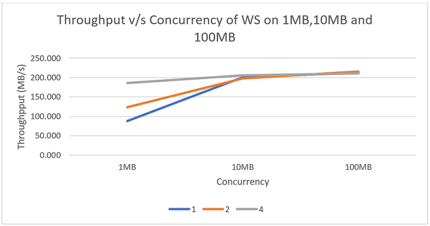
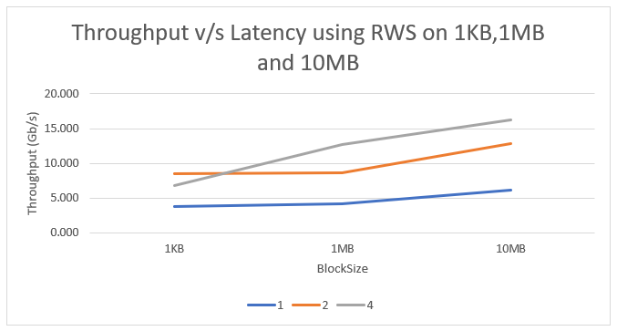

# Cluster Resource Benchmarking

#### Compare theoretical peak performance of resources with experiment results.
#### Evaluate concurrency performance using Threads. Use Strong Scaling for experiments.

## Tasks:
1. Implement CPU Benchmarking 
2. Implement Memory Benchmarking 
3. Implement Disk Benchmarking
4. Implement Network Benchmarking 

####
* RWS - Read Write Sequential 
* RWR - Read Write Random 
* WS - Write Sequential 
* RS - Read Sequential 
* RR - Read Random

#### Results:

